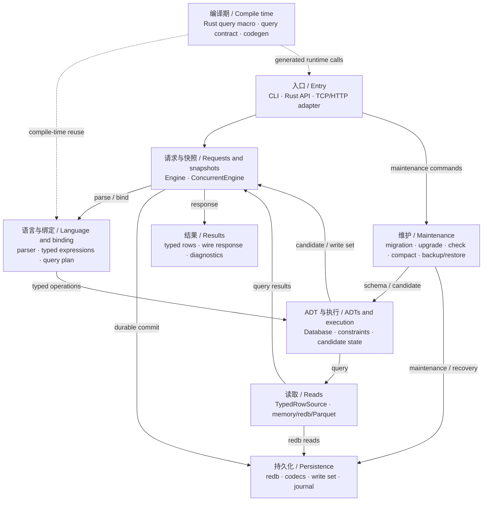
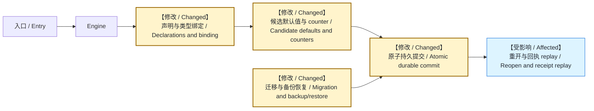

# 架构与 PR 改动地图 / Architecture and PR change map

## 中文说明

这是帮助审查员定位改动的粗粒度地图，展示职责关系，不是逐函数调用图。箭头上的文字说明关系；一次请求不会经过全部节点。PR 中直接嵌入 Mermaid 图，保留理解修改所需的上下游，把本次修改位置标为 `【修改 / Changed】`，只需要验证而没有代码修改的位置标为 `【受影响 / Affected】`。审查员不应需要打开这份文件才能看到 PR 的修改位置。

读请求：入口 → Engine → 解析与绑定 → typed query → 一致读快照/行源 → 结果。redb 行源按计划读取持久数据；memory 与 Parquet 使用各自行源。写请求：入口 → Engine → 解析与绑定 → 候选 Database 与约束检查 → 持久提交 → 发布新的 committed view → 结果。memory 模式无需 redb 提交；失败的候选不发布，持久提交结果不确定时要求重开。数据库状态与幂等回执在同一提交边界发布。

迁移、升级、check、compact 和备份恢复是维护链路，需要单独解释 schema、持久格式和恢复边界。部分离线维护直接使用存储/备份入口，不要画成普通 query stage。Rust 查询宏在编译期复用语言与 query contract，生成的应用代码在运行时进入 Engine；宏不打开数据库。

## English Description

This coarse map locates responsibilities for reviewers; it is not a function call graph. Edge labels describe the relationships, and a request does not traverse every node. Embed Mermaid directly in each PR with enough upstream/downstream context. Label changed locations `【修改 / Changed】` and unchanged locations requiring validation `【受影响 / Affected】`. Reviewers should see the change locations without opening this document.

Reads go from entry → Engine → parse/bind → typed query → consistent snapshot/row source → result. The redb source reads durable data according to the plan; memory and Parquet have their own sources. Writes go from entry → Engine → parse/bind → candidate Database and constraints → durable commit → published committed view → result. Memory needs no redb commit. Failed candidates are not published; uncertain durable outcomes require reopening. Database state and idempotency receipts share the commit/publication boundary.

Migration, upgrade, check, compact and backup/restore are maintenance journeys with schema, format and recovery boundaries. Some offline operations use storage/backup entry points directly rather than ordinary query stages. Rust query macros reuse the language and query contract at compile time; generated application code enters Engine at runtime. Macros do not open databases.

## 总图 / Overall map

| 节点 / Node | 主要文件 / Main files | 审查重点 / Review focus |
| --- | --- | --- |
| Entry | `src/cli.rs`, `src/local.rs`, `src/server.rs`, `src/asynchronous/http.rs` | 入口是否一致 / Consistent entry behavior |
| Requests and snapshots | `src/engine.rs`, `src/server.rs`, `src/script.rs`, `src/idempotency.rs`, `src/control.rs` | 原子性、回执、并发、取消 / Atomicity, replay, concurrency, cancellation |
| Language and binding | `src/syntax.rs`, `src/query.rs`, `src/params.rs`, `src/expression.rs`, `src/matching.rs` | 空表也检查类型，prepare/explain 无执行副作用 / Type checking on empty tables, side-effect-free prepare/explain |
| ADTs and execution | `src/model.rs`, `src/schema.rs`, `src/db.rs`, `src/db/` | typed value、约束、候选回滚 / Typed values, constraints, candidate rollback |
| Reads | `src/row_source.rs`, `src/redb_storage.rs`, `src/parquet.rs` | 同一 schema/sequence 的读取 / Consistent schema/sequence |
| Persistence | `src/redb_storage.rs`, `src/redb_storage/`, `src/codec.rs`, `src/ordered_key.rs` | codec、增量写集、提交失败边界 / Codecs, incremental writes, commit failures |
| Maintenance | `src/migration.rs`, `src/db/migration.rs`, `src/backup.rs`, `src/backup/incremental/` | 预检、升级、恢复保留身份 / Preflight, upgrade, identity-preserving recovery |
| Results | `src/protocol.rs`, `src/serde_value.rs`, `src/error.rs` | Rust/wire 往返及错误 / Rust/wire round trips and errors |
| Compile time | `query-macro/src/lib.rs`, `src/query_contract.rs`, `src/codegen.rs` | 宏与运行时语义一致 / Macro/runtime semantic agreement |

## 如何标记 / How to annotate

复杂 PR 复制总图，给实际变更节点加文字标记并可补充颜色。只读路径、持久提交和恢复路径有不同的风险；不要把“测试经过此节点”误标为“此节点实现被修改”。若改变节点间的契约，直接标记对应箭头，并说明 before → after。局部修改保留入口、修改位置和可观察结果即可，不要求展开无关模块。

For a complex PR, copy the map and add textual markers to nodes changed by the final diff, optionally using color. Read, durable-commit and recovery paths have different risks. Passing through a node in a test does not mean its implementation changed. Label changed contracts on edges and explain before → after. A local change only needs its entry, changed location and observable result, without unrelated modules.

例如生成默认值类修改，图中需定位语言声明、候选值生成、counter 持久提交和恢复链路；每个标记必须对应最终 diff。下面是布局示例，不是新功能或发布状态声明：

For generated-default changes, locate declarations, candidate generation, durable counters and recovery. Match each marker to the final diff. This layout example is neither a new feature nor a release-status statement:

图下用 1–3 条说明把职责、关键文件和验证连接起来。例如 `src/db/generated.rs` 的候选 counter：失败批次不消费序号，用回滚后成功插入获得预期序号来验证。兼容性修改还要写清旧 reader 拒绝或继续读取的边界；图不能替代这项说明。

Below the diagram, connect responsibilities, key files and validation in 1–3 notes. For example, candidate counters in `src/db/generated.rs` must not advance on a failed batch; verify the expected sequence on the next successful insert. Compatibility changes must also explain where old readers reject or continue reading. A diagram does not replace that explanation.
