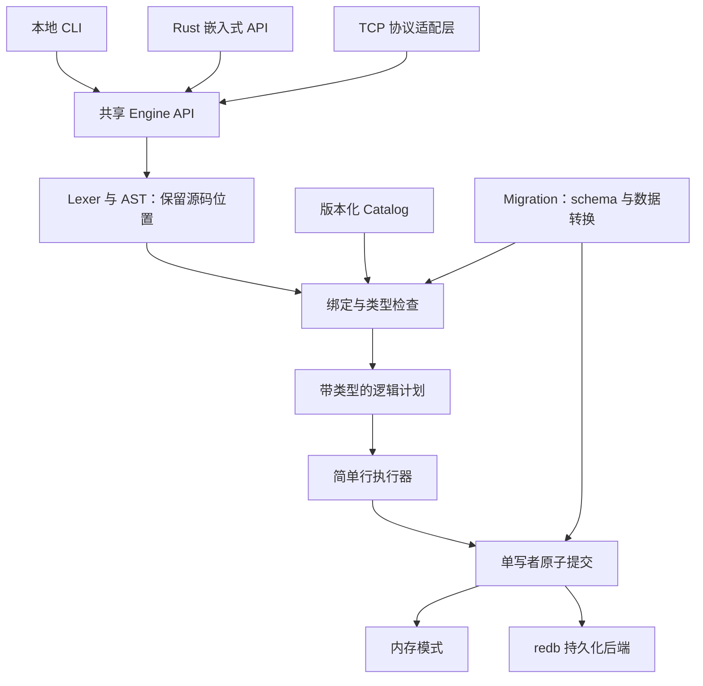

# unionid：原生代数类型数据库设计草案

日期：2026-09-06。状态：完整目标设计，部分子集已实现；当前可执行范围见 [LANGUAGE.md](LANGUAGE.md)，查询语义和能力状态见 [QUERY.md](QUERY.md)，实现与验证见 [开发记录](DEVELOPMENT.md)。其余语法由 M0 的语言设计 issue 继续收敛。用户已明确：类型定义也采用 PRQL 风格，不使用分号，减少影响阅读的标点，不采用 TypeScript 风格的密集类型注解。

本文说明设计理由与目标体验；执行顺序、依赖和完成状态以 [GitHub issues](https://github.com/worktools/unionid/issues) 为准，入口见 [路线图](ROADMAP.md)。当前可运行语法见 [语言文档](LANGUAGE.md)，当前查询行为见 [查询语言参考](QUERY.md)。

## 1. 产品定位

一个面向应用状态、原生理解代数数据类型的单机轻量数据库。用命名类型表达领域模型，用声明式流水线查询和更新，用版本化 migration 安全演进已有数据。

优先验证三个场景：

1. 本地任务工具：任务状态是 `Pending | Running {...} | Done {...} | Failed {...}`，按状态及其负载查询、更新、统计。
2. 小型应用配置：嵌套 record、可选字段和列表；严格校验输入，随应用版本迁移。
3. 单机事件记录：不同事件携带不同结构，按变体筛选和提取字段，少量汇总。

暂按“共享引擎，先本地后服务”规划，这是可调整的优先级假设。嵌入式 Rust API、本地 CLI、TCP 服务使用同一套语言和事务语义。第一版一个数据库只允许一个进程拥有写权限；多个客户端通过拥有数据库的服务访问，打开冲突清楚报错。

目标工作集可容纳于内存，先用 1 万／10 万条、不同负载大小的数据集测量延迟、峰值内存、恢复及 migration 时间。它们是验收工作负载，不是已经测得的容量或性能承诺。实际容量边界由发布基准确定。

## 2. 参考方向与差异

| 参考 | 借鉴 | unionid 的选择 |
| --- | --- | --- |
| SQLite | 本地、少配置、可携带、可靠的应用存储体验 | 提供本地入口；首版数据库路径可为一个目录，不预先承诺单文件格式 |
| DuckDB | 嵌套类型和交互查询体验 | 聚焦应用状态的读写与演进，首版采用简单行执行器 |
| Redis | 简单部署、直接操作状态、可选内存模式 | 以有 schema 的 ADT 为核心；通过主键、upsert、原子批次覆盖状态操作 |
| Haskell／OCaml | 命名和类型、积类型、构造器、模式匹配、纯函数组合 | 小型、严格求值、有界的表达式语言；逐步增加灵活性 |
| PRQL | 从数据源出发的声明式 pipeline，正交的变换 | 自有 AST → 类型检查 → 查询计划 → 执行器，直接操作 ADT |
| Gel migration | 声明目标 schema，生成可检查的变更文件，再应用 | 先保证显式 migration 正确，再提供 schema diff；重命名和数据转换不靠猜测 |

PRQL 编译到 SQL；这里借鉴其语言体验，不承诺 PRQL 语法或编译器兼容。[PRQL 官方介绍](https://prql-lang.org/book/)与[变换语义](https://prql-lang.org/book/reference/stdlib/transforms/)提供参考。DuckDB 已有带 tag 的 UNION 类型，因此差异应体现在类型定义、模式匹配、写入约束和迁移的完整体验，而非仅“能存 enum”。[DuckDB UNION 文档](https://duckdb.org/docs/current/sql/data_types/union)

SQLite 的本地应用定位与 Redis 的可选持久化分别提供使用方式参考，并不意味着要同时复制它们的全部接口。[SQLite 使用场景](https://www.sqlite.org/whentouse.html)、[Redis 持久化](https://redis.io/docs/latest/operate/oss_and_stack/management/persistence/)

## 3. 目标语言体验

以下是完整目标的提案示例，其中包含当前尚未实现的通用函数和部分 pipeline stage，不能直接作为完整脚本执行。普通 filter、match condition 和 derive match 已支持有类型 int/float 算术；filter 与 condition 还支持布尔组合、比较、Option helper 及 `contains/length/any/all`，`derive x = match ...` 可递归解构 ADT 并从 binding 或算术结果构造 option/sum/product/list 值，`aggregate` 和 `group ... aggregate` 已支持 count/sum/min/max，`$name` 参数已可通过 Rust API 与版本化协议绑定。准确限制以 [QUERY.md](QUERY.md) 为准。类型定义和查询采用一致的 PRQL 风格：以换行组织操作，空格表达参数应用，尽量让文字承担含义。**无分号、少标点是已确定的设计约束**；下面的缩进式字段声明与 ADT 分支是本轮推荐草案，具体布局规则由 [语言 issue #2](https://github.com/worktools/unionid/issues/2) 验证后冻结。

PRQL 本身使用空格调用函数，并允许换行连接 pipeline；我们借鉴这些习惯。[PRQL 函数调用与 pipeline](https://prql-lang.org/book/reference/syntax/function-calls.html) PRQL 的类型设计页也讨论 sum/product 组合，但下面的 `field type`、缩进声明和带 tag 的构造器是 unionid 的提案，不能当作现有 PRQL 语法或编译器能力。[PRQL 类型设计](https://prql-lang.org/book/reference/spec/type-system.html)

- 字段写成 `email text`；类型应用写成 `option text`、`list text`，嵌套时写成 `option (list text)`。
- 多行 record 用缩进组织，不要求花括号、逗号或字段后的冒号；紧凑的内联 record 仍用 `{worker text, attempt int}` 明确字段边界。
- 和类型用 `|` 表示分支；这是区分“任选其一”和“同时包含字段”的必要符号。
- 多行查询每行一个 transform；单行查询可用 `|`，不再引入 `|>`。类型与表达式由语法上下文区分。
- 值字段与派生列统一用 `=`，函数与构造器用空格应用；只在分组、嵌套调用或内联集合时保留括号和逗号。注释使用 `#`。
- 复杂表达式优先按逻辑项换行；混用 `and` 与 `or` 时用括号明确分组。括号、record/list/tuple 边界等能直接消除歧义的符号属于可读性设计的一部分，不以机械减少符号数量为目标。

```text
type Contact =
  email text
  nickname option text = None

type State =
  Pending
  | Running {worker text, attempt int}
  | Done {result text}
  | Failed {message text, retryable bool}

type Task =
  id int
  title text
  owner Contact
  tags list text
  state State

table tasks Task
  key id

insert tasks
  id = 1
  title = "同步目录"
  owner =
    email = "alice@example.com"
  tags = ["local", "sync"]
  state = Running {worker = "local", attempt = 2}
```

命名类型可复用于多张表和嵌套字段。表是“以 record 为行”的集合，积类型不止表这一层：还支持 `type Point = (float, float)`，以及变体中的 record／tuple 负载。需要展开变体负载时，也可在 `| Running` 下面缩进书写 `worker text`、`attempt int`；内联与多行布局必须生成同一 AST，格式化器只选择一套规范输出。

```text
from tasks
filter match state
  Running {attempt, ..} => attempt >= $min_attempt
  _ => false
derive
  summary = match state
    Pending => "pending"
    Running {worker, ..} => worker
    Done {result} => result
    Failed {message, ..} => message
select {id, title, summary}
sort id
take 20
```

`$min_attempt` 是 API／CLI 绑定的类型化参数，不通过拼接查询字符串传递。模式中的绑定仅在对应分支内有效；不同分支必须有统一结果类型。`select` 之后访问已移除字段应在执行前报错；空表上也必须检查。未穷尽的 `match` 报错，通配分支显式处理剩余情况。后续可以增加 `filter_map`／`filter case` 简写，先不让新的作用域规则拖延首版。

```text
let retryable = s ->
  match s
    State.Failed {retryable, ..} => retryable
    _ => false

from tasks
filter (retryable state)
select {id, title}

update tasks
filter id == $id
set state = Done {result = $result}

delete tasks | filter id == $id

# upsert 接受完整 Task 值，按声明的主键处理冲突
upsert tasks $task
```

首版 `let` 支持查询内绑定和有类型的非递归纯函数，能从使用位置或限定构造器确定类型时省略注解，如上例的 `State.Failed`；不能确定时给出明确诊断，所需显式注解的最小形式由 RFC 确定。不存函数值，不开放文件、网络、时钟或随机副作用。通用高阶函数、用户定义泛型与递归 ADT 放在独立后续设计中。`option T`、`list T` 先作为内建类型构造器，不能据此宣称已支持任意泛型。

### 无分号的边界规则

无分号需要明确解析边界，不能简单把所有换行删掉或按空行切割。提案使用换行、缩进与语法上下文共同决定边界：声明体和嵌套 record/match 通过缩进进入与退出；`from/update/delete` 后续同层 transform 继续当前 pipeline，遇到新的顶层声明／数据操作起始词或文件末尾结束。`type`、`table`、`let`、`insert`、`upsert` 等顶层形式分别有确定的结束规则，空行和注释本身不提交语句。

括号内及操作数尚未完整时的跨行、相邻多条查询、嵌套 match 后恢复外层 pipeline、不同缩进宽度和混用 tab/空格，都要写入 parser 的正反例。文件以 EOF 结束；REPL 在 AST 完整且无开放布局时由显式提交手势（例如完整输入后空行或提交键）执行，尚未完整则续行。REPL 的提交手势属于交互行为，不成为文件语言中的分号替代物。具体规则与格式化稳定性由 [parser issue #8](https://github.com/worktools/unionid/issues/8) 验收。

## 4. 类型语义必须先明确

- 命名 ADT／record 采用名义身份，字段形状相同的两个命名类型不会自动互换；匿名查询结果 record 采用结构类型。
- 构造器由预期类型解析；有歧义时使用限定名，如 `State.Pending`。非法构造器、参数数目或字段类型均为写入前错误。
- 普通字段必填；缺值通过 `option T` 显式表达。默认值采用 `field type = value`，在 schema 声明时类型检查并存成完整 typed value；遗漏字段只在有声明默认值时逐层补齐，不把遗漏、`None`、空字符串和未知字段混为一谈。首版默认值是纯字面量，不依赖其他字段、参数、时钟或函数。旧版 `null` 由兼容导入规则处理。
- v1 原子类型先收敛到 `int`（i64）、`float`（有限 f64）、`bool`、`text`。时间、UUID、Decimal、Bytes 先评估真实样例再扩展；金额示例用整数最小单位，不暗示 Float 提供十进制定点精度。
- Int 精确比较；混合 Int／Float 运算和转换使用明确规则，不能统一转 f64。建议 v1 默认要求显式转换，字面量可按上下文检查。
- Float 不采用 epsilon 相等；拒绝 NaN／Infinity，统一 `-0.0` 与 `0.0` 的相等、索引键和分组语义。
- record／tuple／sum／Option／List 提供结构相等，sum 相等包括类型身份、变体身份和负载。排序仅对已定义顺序的类型开放，暂不按声明顺序给 enum 排序。
- 字段、变体、类型、表和索引具有稳定 catalog ID；名称与顺序变化不能静默改写旧数据含义。revision、hash、兼容矩阵和 migration 历史约束见 [Schema 身份与演进契约](SCHEMA.md)。嵌套值有深度／大小限制，类型引用循环在 v1 明确拒绝。

这些取舍借鉴 ADT 的构造与分解方式，不照搬完整语言。[OCaml 类型与模式匹配](https://ocaml.org/docs/basic-data-types)、[Haskell 数据类型声明](https://www.haskell.org/onlinereport/haskell2010/haskellch4.html)

## 5. 实现边界



从当前 `main.rs` 拆出可测试的 `lib.rs`。模块逐步演进为 `model/types`、`catalog`、`syntax`、`query`、`db`、`storage`、`migration`、`server`、`cli`，不急于拆成多个 crate。保留清楚的错误字符串，同时内部使用带错误码、源码位置和字段路径的结构化错误。

[ADR 0001](adr/0001-redb-storage.md) 比较了当前 WAL/snapshot、redb 与 SQLite，并选定 redb 作为长期事务后端。评价优先考虑运行时 ADT、类型化索引和单写者模型的贴合度，同时覆盖原子性、进程退出恢复、一致备份、macOS/Linux、格式生命周期和维护成本；可复现实验固定在 `tools/storage-eval`。

每个 Engine 写请求映射为一个 redb 写事务，持久模式使用 `Durability::Immediate` 和 two-phase commit。unionid 维护版本化逻辑 codec、稳定 ID 与有序索引键；redb 负责事务 B-tree、校验和与崩溃恢复。当前源码回放 WAL/snapshot 只保留为过渡兼容输入，不进入长期双写路径。成功响应的持久性、提交结果不确定时的错误语义、逻辑快照备份和格式校验继续由 #13/#14/#20 验收。

查询先用易验证的行执行器。`filter/select/derive/take/sort/group/aggregate` 明确输入输出类型和顺序规则；`take` 与 `filter` 不可随意交换。未排序查询不承诺稳定顺序。先做单列／类型化字段路径等值索引、主键查询和 `explain`；不追求复杂优化器。

## 6. Migration 是核心能力

区分三种版本：语言／协议版本、存储格式版本、应用 schema revision。migration 解决最后一种；数据库软件升级与存储格式转换另有流程。

建议工作流（未来 CLI）：

```text
unionid schema check schema.uid
unionid migration new add_task_priority
unionid migration plan --db ./app.uidb
unionid migration apply --db ./app.uidb
unionid migration status --db ./app.uidb
```

先做用户显式编写、有 `id/parent/checksum` 的线性迁移文件，再增加 `migration diff --schema schema.uid` 生成草稿。`plan` 展示前后 schema、受影响行数、约束、转换与破坏性操作，不修改数据库。声明文件表达目标状态，迁移文件表达可重复执行的历史；线上数据库不能因读取 schema 文件便自动同步或删除字段。

| 变化 | v1 处理方式 |
| --- | --- |
| 新增字段 | 要求默认值或明确回填表达式；新增 Option 字段也写出 `None` 默认 |
| 字段／类型／变体重命名 | 显式 rename，保留稳定身份；不根据相似名称推断 |
| 新增变体 | 数据通常无须重写；旧穷尽匹配、prepared query 和客户端需检查／失效 |
| 删除变体或改变其负载 | 显式模式匹配映射现有值；未覆盖的已有变体阻止提交 |
| 修改嵌套 record／复用类型 | 找到所有引用表、索引与嵌套路径，并验证全部数据 |
| 收紧 Option 或新增唯一约束 | 验证已有行，有违反时报告位置并整体失败 |
| 删除字段／表 | 明确的破坏性步骤与备份方案，不能假定可逆 |

例如把 `Failed {message text}` 改成 `Failed {code int, message text}`，需为旧 `Failed` 值补 `code = 0`，其他变体显式保留；所有引用该类型的表一起迁移。转换表达式与迁移文件沿用同一无分号、少标点语法，只访问迁移输入／已声明参数，不能依赖外部副作用。

每个迁移在一个写事务内提交 schema、行、索引和 ledger。中途失败或重启后只出现完整旧版本或完整新版本；重复 apply 跳过已成功应用项，已应用文件 checksum 变化与分叉历史报错。migration 期间可以短暂停写；首版不做在线双 schema、分布式迁移或自动生成无损 down。已提交变更通过后续前向 migration 修正，需要恢复旧数据时走备份还原。借鉴 [Gel 的声明式迁移流程](https://www.geldata.com/showcase/migrations)。

## 7. 使用体验与发布门槛

- 本地 `--db`／显式 `--memory`，服务端 `server --db`；持久模式默认同步提交，内存模式直白说明数据生命周期。
- 多行 REPL、历史、补全、格式化、`.tables/.schema/.types`、文件／stdin 执行；终端表格与脚本 JSON 输出分开，错误有非零退出码。
- 版本化 JSON Lines 请求信封承载查询源码（换行转义）、类型化参数与 request ID；响应提供列顺序、类型、schema revision、行或结构化错误。ADT 与 i64 必须可无损往返。
- 参数绑定、查询取消、请求／结果／内存限额；服务默认 loopback，使用有界连接与请求队列。远程认证和加密是独立需求，首版面向本机受信客户端。
- 单条写语句原子，提供显式原子批次；发布前验证并发写序列化、失败回滚和恢复。
- 备份／还原包含 catalog、数据、migration history；旧原型数据通过显式导出／转换导入，不静默改变原始文件。
- 运行三个端到端样例，覆盖创建、读写、重启、升级 schema、失败迁移、备份还原；发布二进制与 Rust 使用示例。

首版不包含分布式、复制、MVCC 自研、多写者事务、复杂 join、SQL／Redis 协议兼容、TTL／pubsub、完整 Haskell 类型系统或任意用户代码。它们不构成第一版可用性的前置条件。

## 8. 当前仓库的衔接

基线为 `dfb1a28`，约 1,399 行 Rust。已验证 `cargo check`、`cargo test`、`cargo build`；当前测试数为 0。实际跑通 TCP＋CLI 建表／插入／查询、enum 负载匹配和 WAL／snapshot 正常恢复。

已复现的问题与源码证据见 [原型审计](PROTOTYPE-AUDIT.md)。保留现有小模块和可运行原型作为回归对照；逐阶段替换 parser、类型与存储，不把早期语法当成必须永久兼容的接口。M1 是内存语言预览；完成 M2 持久性门槛后才推荐保存真实数据；完成 M3／M4 才作为能够演进和日常使用的 v0.1 发布。
